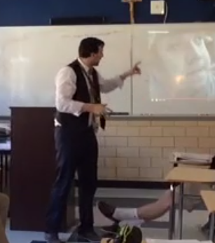
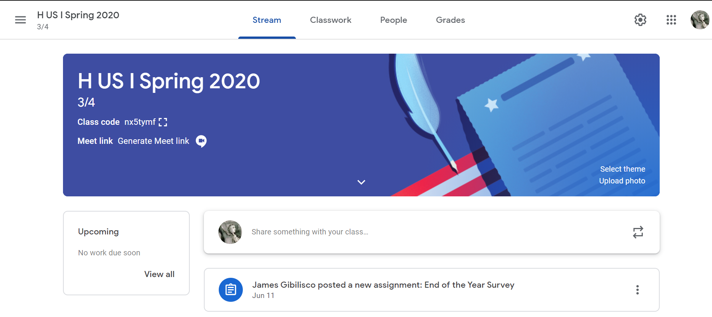

In any education profession, communication is king. It is something that every educator needs to be practicing and becoming better at on a daily basis. In a Ted Talk from 2016, Tim Sullivan said that there was a distinction between being a “teacher” and an “educator.” From his perspective, teacher is a job title and is simply a person who disseminates information and content to their student. However, being an educator seems to be a higher calling in Mr. Sullivan’s eyes since his definition is a person who establishes a safe, proactive learning environment for their students and challenges them to transcend their boundaries every day (Sullivan, 2016). The only way for educators to enable their students to transcend those boundaries is by communicating effectively.

#### Classroom Communication

A classroom should not be a one-way line of communication where the teacher talks and the students listen. This is no way to run a classroom where every diverse learner can be challenged everyday. Students need to be engaged and participate in their own learning (Fisher & Frey, 2018). There are quite a few classroom strategies that I implement in order to accomplish this. First, I strive to ask Open-Ended Questions, not questions that require a one-word response. Open-ended questions are important for sparking discussion and demonstrating that there are multiple ways to perceive and answer questions. Next, I plan assignments and activities that use critical thinking and problem solving- either verbally or written. I want my students to have as many chances to creatively solve and answer questions and express themselves. Another great strategy is to have reflection times at the ends of classes so that students can think through the material for themselves and apply it and share it back. This gives insight into the way their mind is processing what they are learning. Lastly, I have activities that are collaborative in nature (8 methods, n.d.). The more that students feel that they are in control of their own destinies and control of the content in the classroom, the more engaged they are going to be, which in turn opens a new line of communication between student and teacher.

#### Reflection of Concepts and Methods

Being a newer teacher of 4 years, reflecting on the classroom experiencthat has been gained is vital to becoming a more effective instructorMany times, teachers break down directions and content where they thinthey are being perfectly clear. However, this is not always the case. Tbe more effective, one aspect of teaching that I want to continually bmindful of is to implement tangible directions, specific and concrete. Thneed for specificity is supported by the following, “You are more likelto understand verbal interactions if they involve the exchange oconcrete, specific information. Vague language may so obscure the messagthat it may not be possible to determine what the speaker intended(Friend, 2017, p. 71). Any type of direct instruction should be concisenough so that students can process, understand, and complete eacindividual task.

Another great lesson is that no matter how clear an educator thinks they are being, perspective plays a big part in the way that students perceive instruction. This is not new information and it is also supported by the statement, “The meaning of a single word or nonverbal cue depends not only on the context in which it occurs but also on its specific meaning to the individual using the word or demonstrating the behavior and to the individual observing and interpreting it” (Friend, 2017, p. 70). Due to this observation, there are small adjustments that I will implement into my classroom. Firstly, when giving direction, the fewer and most precise wording needs to be used as much as possible. When there are too many directions given, the task is not clear. Therefore, any prompts or bigger projects should be scaffolded out into smaller directives so that students can accomplish each of the individual goals to create a larger project.
Another adjustment is to more carefully lay out direct instruction. Students are going to use their backgrounds and experiences in order to learn new material. With this in mind, teachers need to use precise wording when giving lectures or other forms of distributing information so that their students grasp as close to the teacher’s intent as possible.
Small adjustments are vital changes to becoming a clearer communicator and educator which, in turn, increases student engagement.

#### Online Communication and Classrooms

In a digital world, being able to communicate with students online is imperative for a 21st century teacher. Our educational technology advancements have truly made this easier than ever before in the history of education. There are a couple of ideas that can help teachers teach on an online platform and still build a relationship with students. First, I make my online classroom environment interactive and engaging. Just because you cannot be in their physical presence does not mean that discussion and group activity ceases to exist. Next, I continually ask for feedback from my students. In an online setting, I do not have the communication method of reading body language, it can be difficult to gauge what is working and what is not. My students know that I want to know what they need in order to build lessons directed at their needs. Lastly, with a full online class, it can be hard to have your personality and teaching style shine through. I make an effort to share a piece of myself in the virtual classroom so that relationships can develop.

