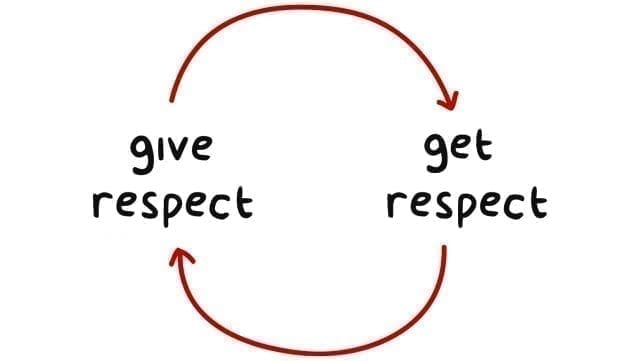
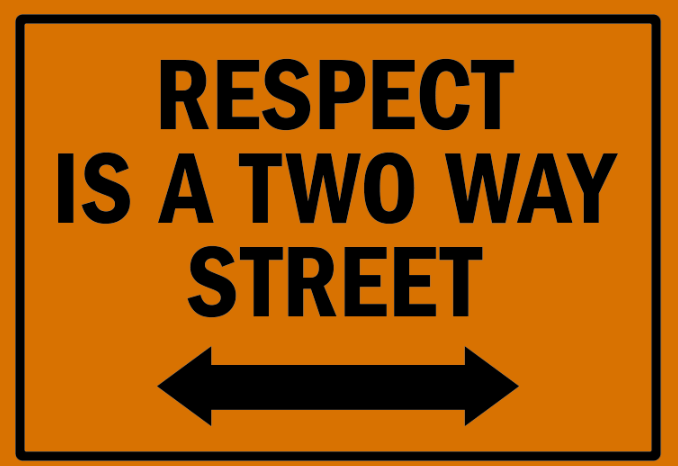

### Interpersonal Problem Solving

In this situation, it is important for the teacher to convey that not only is there a lesson for the student, but the parent must also realize that a change of philosophy is needed for them as well. It can be very difficult for teachers to get through to parents but keeping the email as professional as possible will go a long way (Friend, 2017). When a parent sees a teacher going out of their way to teach a life lesson and improve the whole person, not just the student in the classroom, many parents are appreciative of that extra time the teacher puts in. It is also clear in this email that the teacher was giving a very concise and pointed account of the entire matter and if the parents want a fuller perspective, that a phone conference is necessary (10 rules, n.d.). It also elicits an email response to set up a phone conversation, so it does not imply that this email serves as the only correspondence for this situation (Friend, 2017). The teacher should want to set up a phone conference since written word really reduces the communication that can happen when speaking on the phone or even in person (paulendress, 2008). Lastly, it was very important for the teacher to omit the other student’s name that was in the fight with Damien. Billy will also have a behavior modification program applied to hopefully reduce his name calling and fighting in the situation. However, that is no business of Mr. and Mrs. Chase- they only need to know that the other student is suffering consequences for his role in the altercation and that similar actions are being taken in his case.

