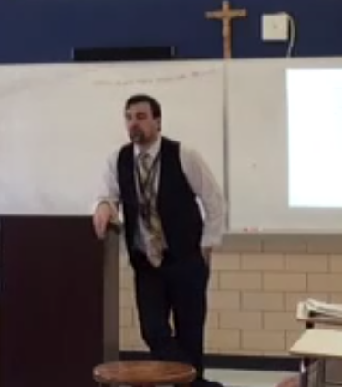

A tremendous part of humanity’s communication is through their body language and nonverbal communication. In an article from Edutopia, Paul Gavoni is quoted saying “It is very much like a transmitter that is constantly pumping out signals” in which he is speaking about body language (Gavoni, 2015, Par. 7). A teacher needs to be aware of the body language and nonverbal cues that they are sending out, just like teachers need to be masterful at reading nonverbal cues. For teachers, it is important that our body language is neutral and consistent. Students can see when teachers are getting tense, angry, sad, or any other negative emotions that can be emitted without saying them. However, a teacher needs to control this and be even keel throughout the time in which students are being interacted with, even if the frustration is mounting inside. This shows students that your teacher is consistent, is reliable and trustworthy and should always be respected even when students are not behaving appropriately. A small nonverbal cue, like in the video below, can be even more effective than any spoken word.

<video style="max-width: 100%" controls="controls">
  <source type="video/mp4" src="nonverbal_cues.mp4"></source>
  
Your browser does not support the video element.

</video

Vice versa, teachers need to watch out for nonverbal cues of students. Facial expressions will often be a sure tell for students. They wear every emotion on their face so I never ignore it if a student is looking confused or a little downtrodden. That is a perfect time to begin an interaction that is helpful. Students’ posture is also a nonverbal cue teachers should look out for. When a student is slouching or leaning back really far in their chair, that is a sign that they are a bit too relaxed. Another cue to look out for would be the pace in which students work. Some students are going to work faster than others purely due to mastery of content. Others might just choose to not work- that’s a cue that again, can start an interaction of what is boring them or what is wrong with the assignment to them. All nonverbal communication is going to be dependent on the individual.
Reading these cues can only help a teacher in building relationships and establishing communication that benefits both them and their students.

#### Personal Reflection of Nonverbal Cues

Again, being a reflective teacher, I have thought about how I could improve my own nonverbal cues. The first thing is my body language. During one of my student-teaching video observations, there were times when I was not teaching and having my students do cooperative learning and I was leaning against the podium or the board. Body language speaks volumes when it comes to communicating emotion and internal thought (Friend, 2017). When I am in class, I want to make sure that my body language is given off a very focused and energized persona so that my students know that I am just as engaged as they are in the lesson- whether it is direct instruction or not.
Another part of my nonverbal communication that I want to work on is effective listening. Teachers’ days are jam-packed and many times it feels as if there are not enough hours in the day to complete everything. There are times when students come to talk to me and I am trying to accomplish a few different tasks and do not give off the impression that I am effectively listening. This is supported by Marilyn Friend and Lynne Cook (2017) when they speak about insufficient time for communication, “School professionals are asked to do many things simultaneously and often in too little time. One of the most frequent barriers to listening and detriments to effective relationships is the especially unproductive ‘Okay, I’ll take care of it’ response” (61). I do not want to do this to students ever and I feel like I could be a much more effective communicator and educator when that behavior is completely eradicated.
