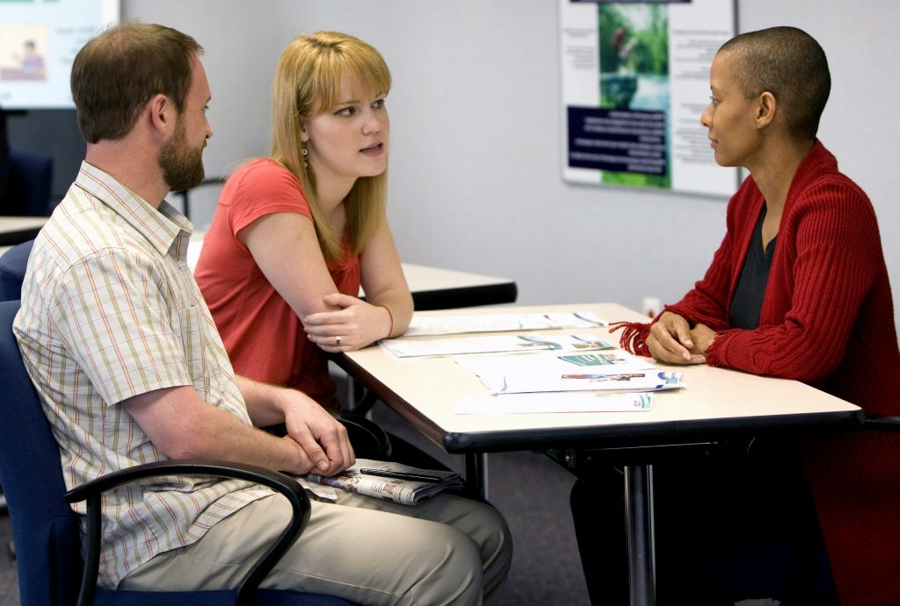

The whole reason for this site is to explain how I can engage students more effectively within my classroom. One of the greatest assets to any teacher is their colleagues, whether it be other teachers or administration. Any educator can utilize the manpower, or brainpower, that is within their school to collaborate and become more effective instructors. One of the ways that this can take shape is through professional learning communities.
Professional learning communities (PLC) can be one of the most helpful resources to teachers within their schools. Being a part of a PLC can give tremendous insight since teachers can collaborate with other teachers who are instructing the same student population with the same tools at their disposal. In a Ted Talk, Dr. Shelle VanEtten de Sánchez recognizes the importance of collaboration by stating, “I came to this place from not enough, not enough resources, not enough money, not enough time, to achieve the work that could be done and sometimes the work that should be done. But thankfully, I realized that important projects can happen by seeking out admirable partners and diverse collaborators who are willing to share ideas and share work” (VanEtten de Sánchez, 2014). This is exactly what is accomplished since teachers can give valuable input about both the success and failures of the classroom and gain the perspective of others in order to make their “important projects” (their lessons) as effective as possible.

In order to make this work, teachers have to be willing and able to collaborate and communicate. It cannot be a one-way street and all must recognize that they must contribute in order for a PLC to be truly successful. In Interactions: Collaboration skills for school professionals (8th ed.), the authors state, “Teachers must reciprocate with patience, recognizing that high-quality results are only likely with considerable effort. It is in this type of mutual understanding of the possibilities and constraints of consultation, coaching, and mentoring that skills for collaboration might be most necessary for all participants” (Friend, 2017, p. 204). Everybody that is a part of that community has to have their top priority be getting better as an instructor, a teacher, and a professional.

#### Seeing Parents as Advocates

Another member of the team in educating a child is their family support system. Teachers need to see parents as advocates at home. The more parents know what is going on in the classroom of their student, the more they can support their child at home and reinforce what is happening in the classroom. With the technologies available, it has never been easier for me as a teacher to reach out to a parent and inform them about what is happening with their student. Providing information should be a priority, “Families should have readily understood information about their child’s educational needs, available services, resources, and procedural information about their rights and responsibilities if they are to participate effectively in their child’s education” (Friend, 2017, p. 279). I want to make it a routine to reach out to parents, through email or phone call, and just talk to them about small successes in the classroom and the progress of their students. Not every call has to be because of some negative action that a teacher is reporting home about. Parents appreciate teachers taking the time to drop them a note or update. This is a way to make a parent an advocate, build a stronger connection and understanding with the student’s home life, which makes it easier for me to understand and communicate with that student- I gain more of their perspective.
